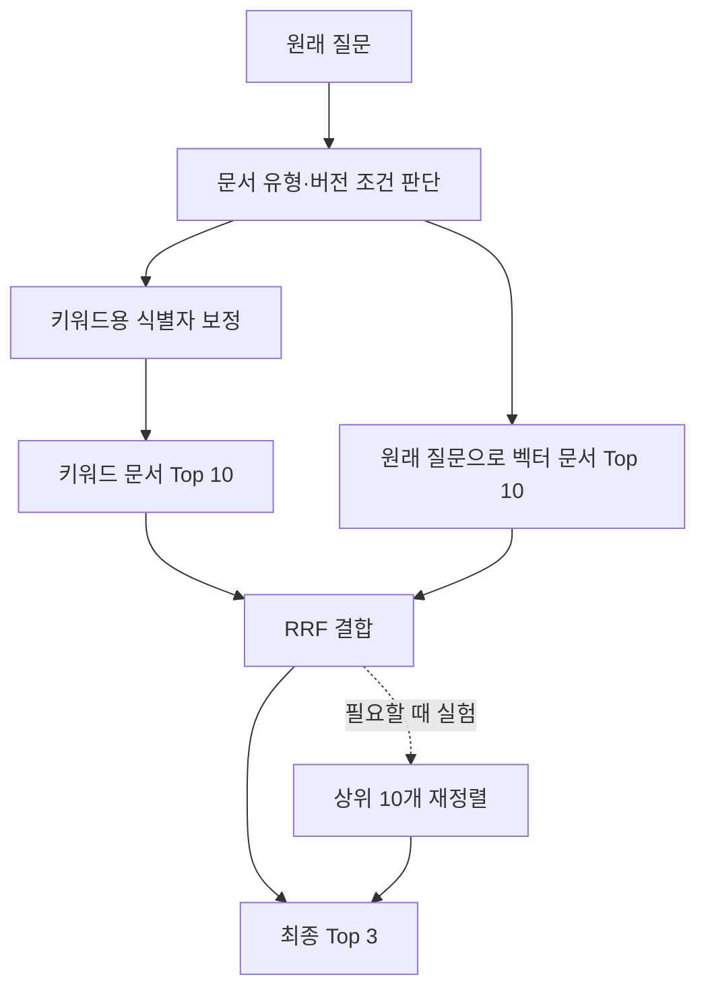

# LLM Wiki v2 — 검색 품질 개선 실험

> **검색 방식을 결합한다고 품질이 좋아지지는 않았다.** 식별자 보정의 효과와 hybrid 결합의 실패를 같은 질문으로 확인한다.

이 글은 현재 시스템에서 검색 실패를 직접 재현하고, 원인을 확인한 뒤 하나씩 고치는 과정을 기록한다. 각 단계는 **변경 전 결과 → 원인 확인 → 구현 내용 → 같은 질문의 변경 후 결과 → 다른 질문에 미친 영향** 순서로 작성한다.

오류 코드의 조사 제거는 키워드 Hit@3를 1/20 → 2/20으로 개선했다. 반면 **동일 가중치 RRF hybrid는 벡터 대비 Hit@3가 14/20 → 11/20으로 낮아져 품질 개선에 실패했다.** E-021이 목록 맨 앞에 나온 것도 동점 정렬의 결과였다. 기본 검색은 벡터로 유지하고, hybrid는 재현·비교용 옵션으로 남겼다.

## 진행 현황

각 단계에서 문제 재현·원인 확인·구현·평가·API·MCP 연결을 함께 진행한다.

| 단계 | 작업 | 상태 |
| --- | --- | --- |
| 1단계 | 키워드 검색 보정 | 오류 코드 조사 제거 적용 완료 — 키워드 Hit@3 1/20 → 2/20 |
| 2단계 | Hybrid 검색 실험 | 구현·평가 완료 — 벡터 대비 Hit@3 14/20 → 11/20, 기본 검색으로 미채택 |
| 3단계 | 최신 버전 필터 | 예정 — 현재 정책과 과거 버전 질문을 구분해 검색 |
| 4단계 | 후보 누락 진단·재정렬 | 예정 — 누락 지점을 확인하고 필요한 경우 reranker 실험 |

## 1단계 — 키워드 검색 보정

### E-008을 물었는데 E-001부터 나왔다

**질문: E-008은 어떤 오류인가요?**

| 순위 | keyword · 보정 전 | vector |
| --- | --- | --- |
| 1 | E-001 · 주문 검증 실패 | **E-008 · DB 커넥션 고갈 — 정답** |
| 2 | E-002 · 재고 부족 | E-002 · 재고 부족 |
| 3 | E-003 · 결제 승인 거절 | E-007 · 요청 한도 초과 |
| 왜? | `-008`은 일치하지 않고 공통 `e`만 매칭돼, 동점(1.4점) 문서가 ID순으로 나왔다. | E-008 청크의 코사인 유사도가 가장 높아(0.799637) 1위로 나왔다. |

**어떻게 개선할까? — 키워드 검색 전에 오류 코드에 붙은 조사를 분리한다.**

DB에서 `to_tsvector('simple', 입력)`을 직접 실행해 차이를 확인했다.

```text
E-008   → '-008', 'e'
E-008은 → '008은', 'e', 'e-008은'
```

키워드 검색 직전에 오류 코드에 붙은 알려진 조사를 제거한다. 벡터 검색에는 원래 질문을 전달한다.

```text
사용자 질문
"E-008은 어떤 오류인가요?"
         ↓ 조사 제거
"E-008 어떤 오류인가요?"
         ↓ 기존 키워드 검색
'e', '-008', '어떤', '오류인가요'
         ↓
문서의 '-008'과 매칭 → E-008이 1위
```

**적용 결과:** 원래 질문 그대로 API·MCP에서 E-008이 1위(2.8점)로 반환됐고, 20문항 키워드 Hit@3는 1/20 → 2/20으로 개선됐으며 기존 성공 문항은 유지됐다.

## 2단계 — Hybrid 검색 실험

기존 사례는 [v1 평가](https://github.com/hhk22/llm-wiki/blob/v2-search-quality/evaluation/results-v1.json)와 [20문항 hybrid 평가](https://github.com/hhk22/llm-wiki/blob/v2-search-quality/evaluation/results-v2-hybrid.json)로 비교한다. 아래 E-025 사례는 이후 추가로 확인한 탐색 질문이며, 기존 20문항 점수와 분리한다. 버전 필터·reranker는 아직 적용 전이다.

### 식별자를 알아도 정답이 뒤로 밀린다

키워드·벡터 검색의 문서 Top 10을 RRF로 결합했다. 원점수 대신 각 순위의 `1 / (60 + 순위)`를 더하고, 양쪽에 있는 문서는 벡터 검색의 근거 청크를 사용한다.

**키워드 검색 대비 개선된 사례: 같은 서비스의 배포가 겹칠 때 발생하는 E-025는 어떻게 막나요?**

| 순위 | keyword | vector | hybrid |
| --- | --- | --- | --- |
| 1 | faq-q07 | **error-E-025 — 정답** | **error-E-025 — 정답** |
| 2 | **error-E-025 — 정답** | deploy-guide-v23 | error-E-017 |
| 3 | error-E-017 | faq-q27 | faq-q27 |

**왜?** E-025는 키워드 2위·벡터 1위의 점수를 합쳐 0.032522를 받았고, 다음 후보의 0.030798보다 높아 동점 없이 1위가 됐다. 반환된 청크에는 배포 잠금 부재와 v23의 잠금 도입이 담겨 있었다.

**적용 결과:** 키워드 검색의 정답 순위는 2위 → hybrid 1위로 개선됐다. **벡터도 이미 1위였으므로 벡터 대비 개선은 아니다.** 성공 사례를 확인하기 위해 추가한 질문 4개 모두의 [검색 결과](https://github.com/hhk22/llm-wiki/blob/v2-search-quality/evaluation/hybrid-example-check.json)를 남겼으며, 이 사례를 전체 품질 향상의 근거로 확대하지 않는다.

**개선되지 않은 사례: E-021 오류가 발생하면 어떤 설정을 확인해야 하나요?**

| 순위 | keyword | vector |
| --- | --- | --- |
| 1 | **error-E-021 — 정답** | faq-q07 |
| 2 | faq-q07 | **error-E-021 — 정답** |
| 3 | faq-q18 | error-E-016 |

**한계:** E-021과 FAQ Q07은 RRF 점수가 같아(각 0.032522) 문서 ID순으로만 순서가 정해졌으므로, 관련성을 더 정확히 구분한 사례로 볼 수 없다.

**[전체 평가](https://github.com/hhk22/llm-wiki/blob/v2-search-quality/evaluation/results-v2-hybrid.json) (고정 20문항, Hit@3): 벡터 70%(14/20) > 키워드 보정 + 벡터 RRF 55%(11/20)**

**다음 보정:** 특정 코드의 의미·대응을 묻는 질문은 식별자 일치를 우선하고, 일반 질문은 벡터 비중을 높인 뒤 기존·별도 검증 질문에서 벡터 단독 대비 개선과 기존 성공 유지가 확인되면 기본 검색에 적용한다.

## 3단계 — 최신 버전 필터 (예정)

### 최신 정책과 유사한 문서는 다르다

**현재 프로덕션 배포 명령은 무엇인가요? (keyword)**

1. deploy-guide-v02
2. deploy-guide-v03
3. deploy-guide-v04

**왜?** 키워드가 일치하는 문서 중 점수로 정렬할 뿐, 최신 버전을 선택하는 조건이 없다.

**같은 질문 (vector)**

1. faq-q01
2. deploy-guide-v15
3. deploy-guide-v21

**왜?** 의미 유사도만으로는 여러 버전 중 최신 정책인 `deploy-guide-v30`을 보장할 수 없다.

**어떻게 개선할까? — 현재 정책을 묻는 질문에만 최신 버전 조건을 적용한다.**

| 질문 의도 | 검색 범위 |
| --- | --- |
| 명시한 버전: “배포 가이드 v22의 금지 시간은?” | 해당 가이드 버전 |
| 변경 이력: “배포 금지가 바뀐 계기는?” | 과거 가이드와 장애 문서 유지 |
| 현재 정책: “현재 프로덕션 배포 명령은?” | 배포 가이드의 최신 버전 |
| 불분명한 질문 | 제한하지 않음 |

명시한 버전과 변경 이력을 먼저 확인하고, **현재 배포 정책으로 판단한 경우에만** 최신 버전으로 범위를 좁힌다. 이 조건을 양쪽 검색의 후보 선정에 적용한다.

```text
사용자 질문
"현재 프로덕션 배포 명령은 무엇인가요?"
         ↓ 특정 버전·변경 이력 질문인지 먼저 확인
현재 배포 정책 질문으로 판단
         ↓ 배포 가이드의 버전을 숫자로 비교
가장 큰 버전 선택: 현재 데이터에서는 v30
         ↓ 검색 범위를 v30의 청크로 제한
키워드·벡터 검색 → 실제 배포 명령이 담긴 근거 확인
```

**적용 후 검증:** 최신 질문은 v30의 `현재 규칙` 청크에서 실제 배포 명령을 찾아야 한다. v22 질문과 변경 이유 질문은 과거 근거를 유지해야 하며, 별도 테스트에서 v31을 추가하면 최신 선택도 바뀌어야 한다. `벡터 + 필터`와 `hybrid + 필터`를 따로 평가한다.

최신 번호를 `30`으로 고정하거나 평가 파일의 정답을 검색 조건으로 쓰지 않는다. 현재 데이터에서는 `topic=deploy-guide`가 하나의 버전 묶음이며, 여러 가이드를 다루게 되면 별도의 버전 묶음 ID가 필요하다. 최신 문서 하나로 범위가 좁아져 얻는 개선은 **버전 선택 규칙의 효과**로 기록한다.

## 4단계 — 후보 누락 진단·재정렬 (예정)

### 관련 문서 하나만으로는 부족하다

**목요일 오후가 배포 금지 시간으로 바뀐 계기가 된 장애는 무엇인가요? (keyword)**

1. error-E-030
2. faq-q02
3. **deploy-guide-v22 — 필요한 근거 중 하나**

**왜?** 필요한 두 문서 중 가이드만 Top 3에 있고, 원인 장애 문서 `incident-18`은 빠져 있다.

**같은 질문 (vector)**

1. **deploy-guide-v22 — 필요한 근거 중 하나**
2. incident-26
3. deploy-guide-v05

**왜?** 변경 가이드와 유사한 문서는 찾았지만, 변경 원인을 설명하는 `incident-18`까지 함께 찾지 못했다.

**어떻게 개선할까? — 먼저 정답이 후보에 있는지 확인하고, 있을 때 재정렬한다.**

필요한 두 문서가 어느 단계에서 빠지는지 먼저 확인한다. 정답 ID는 평가에만 사용하고 실제 검색이나 순위 결정에 전달하지 않는다.

```text
필요한 근거: deploy-guide-v22 + incident-18
         ↓ 평가 시 각 단계의 후보를 확인
키워드·벡터 후보 합집합 → RRF Top 10 → 최종 Top 3
         ↓ incident-18이 빠지는 지점에 따라 대응
후보에 없음     → 후보 확대·관련 문서 참조 탐색 검토
후보에 있음     → 재정렬로 순위를 높일 수 있는지 실험
```

후보에 있지만 순위가 낮다면, LLM으로 질문과 근거의 관련성을 다시 판단하는 reranker를 실험한다. 모델·프롬프트·후보 수는 실험 전에 고정한다.

```text
질문 + RRF 상위 후보 10개의 근거 청크
         ↓ LLM이 질문과의 관련성을 다시 판단
후보 문서의 새로운 순서 반환
         ↓ 누락·중복·후보 밖 문서가 있는지 검증
정상 응답      → 새 순서에서 Top 3 선택
잘못된 응답·실패 → 기존 RRF 순서로 복구하고 횟수 기록
```

**적용 후 검증:** 같은 후보·청크로 재정렬 전후를 비교해 두 근거가 모두 Top 3에 들어가는지 확인한다. 추가 호출의 지연·토큰 비용과 fallback 횟수도 기록한다. 후보에 `incident-18`이 없다면 재정렬로 해결할 수 없으므로, 후보 확대나 문서의 명시적 참조를 따라가는 검색을 후속 실험으로 남긴다. 효과가 작으면 reranker를 기본 경로에 넣지 않는다.

## 전체 실험 흐름

문서 120개·청크 150개, 임베딩 모델과 768차원 설정을 유지한다. 아래는 필터와 재정렬을 비교할 실험 구조다. 현재 기본 경로는 벡터 검색이며, hybrid를 더 좋은 검색 방식으로 전제하지 않는다.



필터 실험에서는 양쪽 검색에 같은 조건을 적용하고 문서별 대표 청크 하나를 반환한다. 이번에 실패한 설정은 후보 10개·RRF 상수 60·동일 가중치 조합이다. 다른 설정도 별도 검증이 필요하며, 벡터 단독 대비 품질과 비용을 확인한 뒤 채택 여부를 판단한다.

## 공통 평가 기준

기존 질문 20개와 정답을 유지한다. 구성 요소의 효과를 구분하기 위해 **벡터 + 필터만 적용한 결과**도 비교한다.

| 비교 실험 | 확인할 효과 |
| --- | --- |
| v1 키워드 → 식별자 보정 키워드 | 식별자 처리만 바꿨을 때의 변화 |
| v1 벡터 → 벡터 + 필터 | 최신성·문서 유형 조건의 효과 |
| v1 벡터 → 기존 키워드 + 벡터(RRF) | 순위 결합만의 효과 |
| 기존 RRF → 식별자 보정 키워드를 사용한 RRF | 키워드 보정이 hybrid에도 도움이 되는가 |
| Hybrid → Hybrid + 필터 | 결합 검색에서도 필터가 유효한가 |
| Hybrid + 필터 → Reranker 추가 | 같은 후보의 재정렬이 필요한가 |

이후 Hybrid 비교에는 보정한 키워드를 사용한다. Hit@1은 단일 정답 15개, Hit@3는 전체 20개에 대해 v1과 같은 방식으로 계산한다. 교차 문서 질문은 필요한 두 문서가 모두 Top 3에 있어야 성공이다. 문서별 대표 청크 하나를 반환하는 기준도 유지한다.

목표는 **전체 Hit@3 14/20을 넘기면서, 이미 성공한 질문을 잃지 않는 것**이다. 정확한 식별자 질문은 Hit@1, 최신 정책은 0/5에서의 변화, 교차 문서는 두 근거가 함께 남는지를 따로 확인한다. 퇴보한 질문은 총점에 가리지 않고 기록한다.

문서 ID만 맞는 결과를 성공으로 과장하지 않도록, 다음 근거도 함께 남긴다.

- **실패 위치:** 두 검색의 후보 합집합 → RRF 상위 10개 → 최종 Top 3에서 정답이 어느 단계에 빠지는지.
- **근거 내용:** 대표 청크에 질문의 답이 실제로 들어 있는지. 특히 v30의 `현재 규칙` 청크가 전달되는지.
- **시간과 비용:** 같은 환경에서 반복 측정한 검색 지연(p50·p95), 질문 임베딩·재정렬 시간, 추가 모델 호출·토큰 수. 답변 생성 시간은 검색 시간과 구분한다.

기존 20문항은 이미 실패를 살펴본 회귀 평가 세트다. 별도로 표현을 바꾼 최신 정책·과거 버전·버전 미지정 질문과, 미래 버전 추가 시 최신 선택이 바뀌는 검증 사례를 준비한다. 규칙 조정 전에 고정하고 최종 확인까지 남겨 두며, 기존 20문항 점수와 분리해 보고한다.

## 완료 기준

이번 hybrid 실험은 `evaluation/results-v2-hybrid.json`에 기록했고 v1 결과는 보존했다. 이후 필터·재정렬 실험도 설정과 결과를 별도로 남기고, 이 글에 전후 수치와 대표 성공·실패 사례를 추가한다.

v2의 완료 기준은 **어떤 변경이 어떤 질문을 개선했고, 어떤 실패가 남았는지 재현 가능한 기록으로 설명하는 것**이다. 그 결과를 보고 Wiki 생성·문서 간 연결 같은 다음 단계가 필요한지 판단한다.

v1 구현은 [기준선 브랜치](https://github.com/hhk22/llm-wiki/tree/docs/llm-wiki-devlog), v2 실험 기록과 이후 작업은 [검색 품질 개선 브랜치](https://github.com/hhk22/llm-wiki/tree/v2-search-quality)에서 확인할 수 있다. 현재 코드에는 오류 코드의 조사 제거와 hybrid 옵션까지 반영됐으며, 버전 필터·reranker는 아직 적용 전이다.
