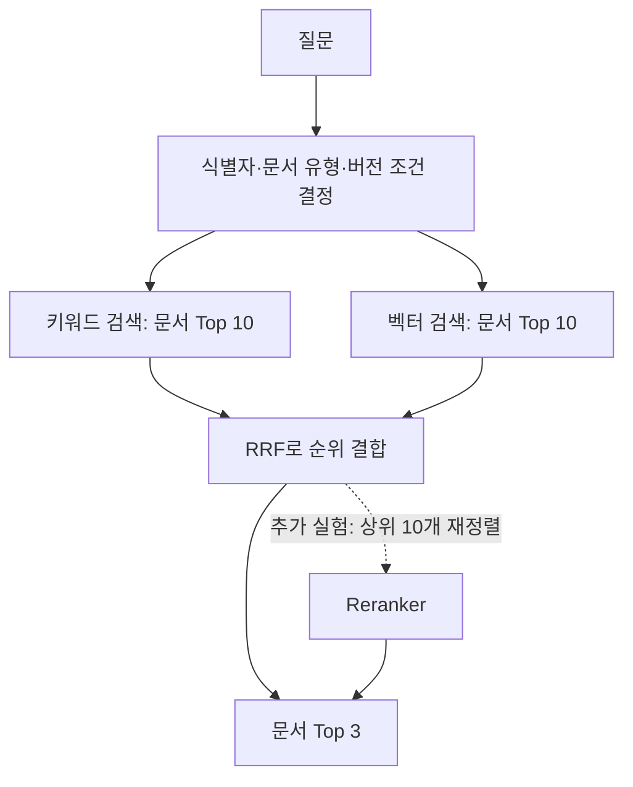

# LLM Wiki v2 — 검색 품질 개선

> **의미가 비슷한 문서에서, 질문에 필요한 근거로.** v1의 실패를 식별자·최신성·순위 문제로 나눠 개선한다.

이 글은 구현 전 계획이다. 아래 v1 수치는 기존 평가 결과이며, v2의 개선 효과는 아직 측정하지 않았다.

## 1. 무엇을 고칠 것인가

[v1](https://github.com/hhk22/llm-wiki/blob/docs/llm-wiki-devlog/blogs/01-rag-baseline.md)의 벡터 검색은 20개 질문 중 14개에서 필요한 문서를 Top 3 안에 반환했다. 실패한 6개는 최신 정책 5개와 문서 간 연결 1개였다. 성공한 질문 중에도 정답이 1위가 아닌 경우가 있었다.

### 식별자를 알아도 정답이 뒤로 밀린다

```text
질문: E-021 오류가 발생하면 어떤 설정을 확인해야 하나요?
키워드 검색: error-E-021이 1위
벡터 검색:   faq-q07이 1위, error-E-021이 2위
```

이 질문에서는 키워드가 정확한 식별자에 강했다. 하지만 식별자를 명시한 다른 질문 4개에서는 키워드도 실패했다. **현재 키워드 검색을 섞기만 하면 좋아질 것이라고 가정할 수 없다.** 먼저 식별자 처리부터 확인한다.

### 최신 정책과 유사한 문서는 다르다

```text
질문: 현재 프로덕션 배포 명령은 무엇인가요?
기대: deploy-guide-v30
벡터 Top 3: faq-q01, deploy-guide-v15, deploy-guide-v21
```

현재 SQL은 의미 유사도로 정렬할 뿐 버전을 제한하지 않는다. 최신 문서를 고르는 규칙은 검색 점수와 별도로 필요하다.

### 관련 문서 하나만으로는 부족하다

```text
질문: 목요일 오후가 배포 금지 시간으로 바뀐 계기가 된 장애는 무엇인가요?
기대: deploy-guide-v22 + incident-18
벡터 Top 3: deploy-guide-v22, incident-26, deploy-guide-v05
```

변경 가이드는 찾았지만 원인이 된 장애 문서는 빠졌다. `incident-18`이 후보에도 없는지, 후보에는 있는데 순위가 낮은지부터 구분한다. 실제 검색 기록은 [v1 평가 결과](https://github.com/hhk22/llm-wiki/blob/docs/llm-wiki-devlog/evaluation/results-v1.json)에 있다.

## 2. 검색을 어떻게 바꿀 것인가

문서 120개·청크 150개, 임베딩 모델과 768차원 설정을 유지한다. 검색 조건과 정렬 방식의 효과를 비교하기 위해서다.



그림은 최종 후보 구조다. 구현과 평가는 아래 변경을 하나씩 적용하며 진행한다.

### 먼저, 식별자를 정확히 처리한다

`E-008은`, `v22에서`, `장애 리포트 #20`처럼 식별자에 조사나 기호가 붙은 질문의 실제 토큰과 점수를 확인한다. 이어서 `E-008`, `v22`, `#20`을 문서 유형과 함께 인식하도록 보정한다.

예를 들어 `E-008은 어떤 오류인가요?`는 에러 코드 문서의 제목·ID와 비교해 `E-008` 일치에 우선순위를 준다. 반면 `E-008과 관련된 장애는?`은 장애 문서도 찾아야 하므로 에러 코드 문서 하나로 제한하지 않는다.

보정 전후의 키워드 검색을 별도로 평가한다. 한국어 문장 전체의 의미 처리를 이 규칙으로 해결했다고 보지는 않는다.

### Hybrid: 두 검색 방식의 순위를 결합한다

키워드와 벡터 검색에서 문서별 대표 청크 하나를 남긴 뒤 각각 상위 10개를 가져온다. 두 목록을 `document_id`로 합치고, RRF(Reciprocal Rank Fusion)로 최종 순위를 정한다.

`ts_rank_cd`와 cosine similarity는 점수 척도가 다르므로 원점수를 더하지 않고, 각 목록에서의 순위를 사용한다. 첫 실험은 동일 가중치와 상수 60으로 고정한다. [RRF 방식 참고](https://www.elastic.co/docs/reference/elasticsearch/rest-apis/reciprocal-rank-fusion)

```text
예시: 같은 문서가 키워드 1위, 벡터 2위라면
RRF 점수 = 1 / (60 + 1) + 1 / (60 + 2)
```

상위 후보에 없는 목록의 기여는 0이다. 후보 10개는 최종 출력 3개보다 넓게 모으기 위한 초기값이며, 최적값으로 간주하지 않는다.

같은 문서에서 두 검색이 서로 다른 청크를 고르면, 우선 벡터 검색의 대표 청크를 사용하고 벡터 후보에 없는 문서는 키워드 청크를 사용한다. 이 선택도 기록해 문서 순위 개선과 근거 청크 선택을 구분한다.

### 최신 버전 필터: 질문에 따라 검색 범위를 바꾼다

모든 질문에 최신 버전 필터를 적용하면 과거 변경 이유를 찾을 수 없다. 명시한 버전과 변경 이력을 먼저 확인하고, 현재 정책을 묻는 경우에만 최신 조건을 적용한다.

| 질문 | 적용할 검색 범위 |
| --- | --- |
| “현재 프로덕션 배포 명령은?” | 배포 가이드의 최신 버전 |
| “배포 가이드 v22의 금지 시간은?” | 명시한 v22 |
| “목요일 배포 금지의 계기가 된 장애는?” | 과거 가이드와 장애 문서 모두 유지 |

`현재/최신 + 배포 정책`, 명시적 버전, `계기/이유/이후` 같은 질문 표현을 출발 규칙으로 삼는다. 의도가 불분명하면 후보를 제한하지 않는다. **평가 파일의 질문 유형이나 정답 ID는 검색 조건에 사용하지 않는다.**

현재 자료에서는 `topic=deploy-guide`가 하나의 가이드의 버전 묶음이다. 그 안에서 `version`을 숫자로 비교해 최대 버전을 선택하고, Top K를 뽑기 전에 양쪽 검색에 동일하게 적용한다. 최신 버전 번호를 `v30`으로 고정하지 않는다. 버전 묶음이 없는 장애·에러·FAQ에는 이 규칙을 적용하지 않는다.

이 필터는 현재 데이터에 맞춘 정책이다. 여러 가이드가 같은 주제에 속하게 되면 `topic`과 별개로 문서의 버전 묶음을 식별해야 한다. 또 “현재 배포 정책”의 후보가 최신 가이드 하나로 좁혀지면 높은 점수는 **버전 선택 규칙의 효과**이지 의미 검색의 향상은 아니다.

### Reranker: 후보 안에서 틀린 순서만 다시 판단한다

필터와 hybrid를 적용해도 정답이 후보 안에서 밀린다면, RRF 상위 10개를 기존 생성 모델에 전달해 질문과 근거 청크의 관련성으로 재정렬하는 실험을 한다. 모델·프롬프트·후보 수는 실험 전에 고정한다.

후보 ID의 순서만 반환하게 하고, 후보 밖 ID나 중복 등 잘못된 출력·호출 실패는 기존 RRF 순위로 복구하며 횟수를 기록한다. 같은 후보와 청크로 재정렬 전후를 비교한다.

`incident-18`이 후보에 없다면 reranker도 되찾을 수 없다. 이 경우에는 후보 수 확대나 문서의 명시적 참조를 따라가는 검색을 후속 과제로 남긴다. 추가 LLM 호출의 지연·비용에 비해 개선이 작으면 기본 경로에 넣지 않는다.

## 3. 무엇으로 개선을 판단할 것인가

기존 질문 20개와 정답을 유지한다. 구성 요소의 효과를 구분하기 위해 **벡터 + 필터만 적용한 결과**도 비교한다.

| 비교 실험 | 확인할 효과 |
| --- | --- |
| v1 키워드 → 식별자 보정 키워드 | 식별자 처리만 바꿨을 때의 변화 |
| v1 벡터 → 벡터 + 필터 | 최신성·문서 유형 조건의 효과 |
| v1 벡터 → 기존 키워드 + 벡터(RRF) | 순위 결합만의 효과 |
| 기존 RRF → 식별자 보정 키워드를 사용한 RRF | 키워드 보정이 hybrid에도 도움이 되는가 |
| Hybrid → Hybrid + 필터 | 결합 검색에서도 필터가 유효한가 |
| Hybrid + 필터 → Reranker 추가 | 같은 후보의 재정렬이 필요한가 |

이후 Hybrid 비교에는 보정한 키워드를 사용한다. Hit@1은 단일 정답 15개, Hit@3는 전체 20개에 대해 v1과 같은 방식으로 계산한다. 교차 문서 질문은 필요한 두 문서가 모두 Top 3에 있어야 성공이다. 문서별 대표 청크 하나를 반환하는 기준도 유지한다.

목표는 **전체 Hit@3 14/20을 넘기면서, 이미 성공한 질문을 잃지 않는 것**이다. 정확한 식별자 질문은 Hit@1, 최신 정책은 0/5에서의 변화, 교차 문서는 두 근거가 함께 남는지를 따로 확인한다. 퇴보한 질문은 총점에 가리지 않고 기록한다.

문서 ID만 맞는 결과를 성공으로 과장하지 않도록, 다음 근거도 함께 남긴다.

- **실패 위치:** 두 검색의 후보 합집합 → RRF 상위 10개 → 최종 Top 3에서 정답이 어느 단계에 빠지는지.
- **근거 내용:** 대표 청크에 질문의 답이 실제로 들어 있는지. 특히 v30의 `현재 규칙` 청크가 전달되는지.
- **시간과 비용:** 같은 환경에서 반복 측정한 검색 지연(p50·p95), 질문 임베딩·재정렬 시간, 추가 모델 호출·토큰 수. 답변 생성 시간은 검색 시간과 구분한다.

기존 20문항은 이미 실패를 살펴본 회귀 평가 세트다. 별도로 표현을 바꾼 최신 정책·과거 버전·버전 미지정 질문과, 미래 버전 추가 시 최신 선택이 바뀌는 검증 사례를 준비한다. 규칙 조정 전에 고정하고 최종 확인까지 남겨 두며, 기존 20문항 점수와 분리해 보고한다.

## 4. 구현 순서와 완료 기준

```text
실패 질문의 토큰·후보·청크 확인, 추가 검증 사례 고정
→ 식별자 보정과 키워드 검색 재평가
→ RRF hybrid 구현·평가
→ 질문별 필터 적용, 벡터·hybrid 각각 비교
→ 남은 순위 오류에 reranker 실험
→ API·MCP에 채택한 검색 방식 연결, 결과 기록
```

실험별 Top 3, 필터 조건, 후보 수, 설정과 지연을 `evaluation/results-v2.json`에 기록할 계획이다. v1 결과는 보존한다. 결과가 나오면 이 글에 전후 수치와 대표 성공·실패 사례를 추가한다.

v2의 완료 기준은 **어떤 변경이 어떤 질문을 개선했고, 어떤 실패가 남았는지 재현 가능한 기록으로 설명하는 것**이다. 그 결과를 보고 Wiki 생성·문서 간 연결 같은 다음 단계가 필요한지 판단한다.

v1 구현은 [기준선 브랜치](https://github.com/hhk22/llm-wiki/tree/docs/llm-wiki-devlog), v2 계획과 이후 작업은 [검색 품질 개선 브랜치](https://github.com/hhk22/llm-wiki/tree/v2-search-quality)에서 확인할 수 있다. 현재 구현은 v1이며, 이 글의 v2 계획은 아직 코드에 반영되지 않았다.
